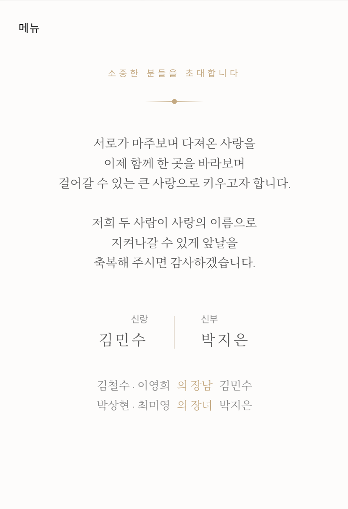
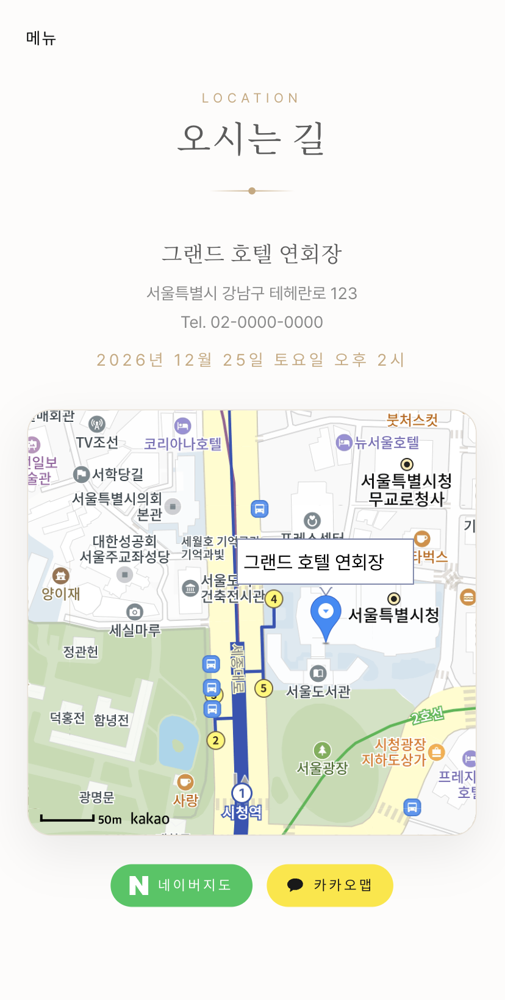
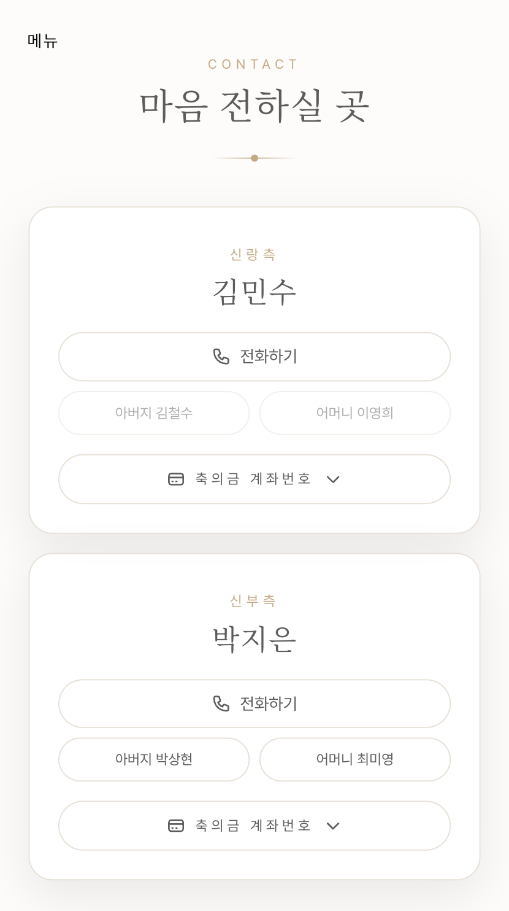

# 💒 모바일 웨딩 청첩장

아름다운 디자인과 부드러운 애니메이션, 카카오맵 연동, 갤러리, 오시는 길 등을 갖춘 반응형 모바일 웨딩 청첩장 웹사이트입니다. Next.js 15, TypeScript, Tailwind CSS를 사용하여 제작되었습니다.

## ✨ 주요 기능

- 🎨 **부드러운 애니메이션**: GSAP을 활용한 스크롤 애니메이션 및 전환 효과
- 📱 **반응형 디자인**: 모든 기기에서 완벽하게 작동
- 🗺️ **인터랙티브 지도**: 카카오맵 연동으로 예식장 위치 안내
- 🖼️ **포토 갤러리**: 아름다운 웨딩 사진을 감상할 수 있는 갤러리
- 🚌 **오시는 길 안내**: 지하철, 버스, 자가용 등 상세한 교통편 정보 제공

## 📸 스크린샷

<table>
  <tr>
    <td width="50%">
      
      <br />
      <sub>메인 화면 - 청첩장 상단</sub>
    </td>
    <td width="50%">
      
      <br />
      <sub>초대의 글 - 예식 정보 및 인사말</sub>
    </td>
  </tr>
  <tr>
    <td width="50%">
      
      <br />
      <sub>메뉴 - 전체 메뉴 및 바로가기</sub>
    </td>
    <td width="50%">
      
      <br />
      <sub>앨범 - 웨딩 사진 갤러리</sub>
    </td>
  </tr>
  <tr>
    <td width="50%">
      
      <br />
      <sub>사진 상세 보기 - 확대된 갤러리 뷰</sub>
    </td>
    <td width="50%">
      
      <br />
      <sub>지도 - 카카오맵 연동 약도</sub>
    </td>
  </tr>
  <tr>
    <td width="50%">
      
      <br />
      <sub>연락처 - 혼주 연락처 및 마음 전하실 곳</sub>
    </td>
    <td></td>
  </tr>
</table>

## 🚀 시작하기

### 필요 조건

- Node.js 18 버전 이상
- pnpm (권장) / npm / yarn

### 설치 방법

1. 저장소를 클론합니다:

```bash
git clone <your-repo-url>
cd wedding-invite
```

2. 의존성을 설치합니다:

```bash
pnpm install
# 또는
npm install
```

3. 환경 변수를 설정합니다:

```bash
cp .env.example .env
```

4. [Kakao Developers](https://developers.kakao.com/)에서 카카오맵 API 키를 발급받아 `.env` 파일에 추가합니다:

```env
NEXT_PUBLIC_KAKAO_APP_KEY=your_kakao_app_key_here
```

5. 개발 서버를 실행합니다:

```bash
pnpm dev
```

6. 브라우저에서 [http://localhost:3000](http://localhost:3000)을 엽니다.

## 📝 수정 및 설정

### 1. 예식 정보 수정

[`data/wedding-data.ts`](data/wedding-data.ts) 파일에서 예식 정보를 수정하세요:

- 신랑, 신부 이름
- 혼주 성함 및 연락처
- 예식 날짜 및 시간
- 예식장 정보 및 좌표
- 계좌번호 정보
- 교통편 안내

### 2. 이미지 수정

[`data/wedding-data.ts`](data/wedding-data.ts) 파일의 `images` 섹션을 수정하세요:

```typescript
images: {
  main: "your-main-photo-url",
  background: "your-background-photo-url",
  gallery: [
    {
      src: "photo-url",
      alt: "사진 설명",
      isHorizontal: false, // 가로 사진일 경우 true, 세로 사진일 경우 false
    },
    // 사진 추가...
  ],
}
```

다음과 같은 이미지를 사용할 수 있습니다:

- Unsplash URL (무료 스톡 사진)
- 이미지 CDN 서비스 (Cloudinary, Imgix 등)에 호스팅된 이미지
- `public/gallery/` 폴더 내의 로컬 이미지 (`/gallery/filename.jpg` 형식 사용)

### 3. 지도 좌표 수정

[`data/wedding-data.ts`](data/wedding-data.ts) 파일에서 예식장 좌표를 수정하세요:

```typescript
coordinates: {
  lat: YOUR_LATITUDE, // 위도
  lng: YOUR_LONGITUDE // 경도
}
```

## 🎨 기술 스택

- **프레임워크**: [Next.js 15](https://nextjs.org/) (App Router)
- **언어**: TypeScript
- **스타일링**: Tailwind CSS
- **애니메이션**: GSAP (GreenSock)
- **지도**: Kakao Maps API

## 📦 프로젝트 구조

```
wedding-invite/
├── app/
│   ├── layout.tsx            # 루트 레이아웃
│   ├── page.tsx              # 메인 페이지
│   └── globals.css           # 전역 스타일
├── components/               # 리액트 컴포넌트
│   ├── AnimatedSection.tsx
│   ├── ContactSection.tsx
│   ├── FooterSection.tsx
│   ├── GallerySection.tsx
│   ├── HeroSection.tsx
│   ├── IntroSection.tsx
│   ├── MapSection.tsx
│   ├── Navigation.tsx
│   ├── SmoothScroll.tsx
│   ├── TransportSection.tsx
│   ├── VenueSection.tsx
│   ├── index.ts
│   └── gsap/
│       └── ScrollSection.tsx
├── data/
│   └── wedding-data.ts        # 예식 정보 데이터
├── hooks/
│   └── useGSAP.ts            # GSAP 훅
├── lib/
│   └── gsap/                 # GSAP 설정
├── public/
│   └── gallery/              # (선택사항) 로컬 웨딩 사진
├── types/
│   └── global.d.ts           # TypeScript 타입 정의
├── middleware.ts             # 미들웨어 설정
└── .env                      # 환경 변수
```

## 🛠️ 개발

### 프로덕션 빌드

```bash
pnpm build
```

### 프로덕션 빌드 실행

```bash
pnpm start
```

### 코드 린트

```bash
pnpm lint
```

## 🚀 배포

### Vercel 배포 (권장)

1. 코드를 GitHub에 푸시합니다.
2. [Vercel](https://vercel.com)에서 저장소를 가져옵니다.
3. 환경 변수를 추가합니다.
4. 배포합니다!

### 기타 플랫폼

Node.js를 지원하는 모든 플랫폼에 배포할 수 있습니다:

- Netlify
- AWS Amplify
- Cloudflare Pages
- 개인 VPS

## 📄 라이선스

이 프로젝트는 오픈 소스이며 [MIT License](LICENSE)하에 배포됩니다.

## 🤝 기여하기

기여, 이슈 제기, 기능 요청은 언제나 환영합니다! 이슈 페이지를 확인해 주세요.

## 💝 크레딧

- 웨딩 사진 제공: [Unsplash](https://unsplash.com)
- 제작: [Next.js](https://nextjs.org/)
- 애니메이션 엔진: [GSAP](https://greensock.com/gsap/)

## 📧 지원

템플릿 커스터마이징에 대한 질문이나 도움이 필요하시면 이슈를 등록하거나 연락해 주세요!

---

특별한 날을 위해 ❤️ 로 만들었습니다.
